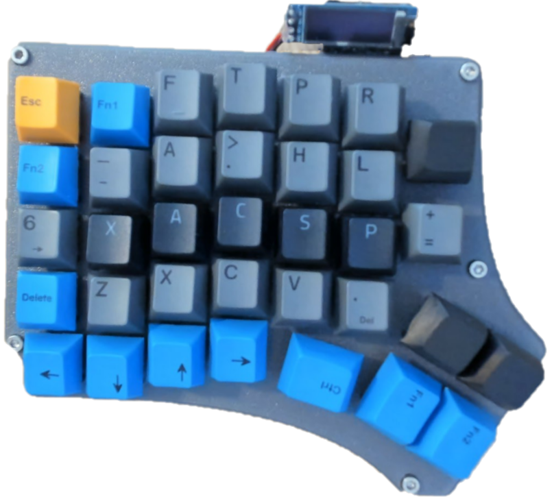

# cadpad

I designed this macropad specifically for use with Freecad!  I would like to use the keyboard shortcuts, however, this routinely has you removing you hand from the mouse which slows things down.  The keymap provides layers so that you can use you favorite shorcuts using your left hand on the pad, and your right hand on the mouse.  There is even a numpad layer! Once I learn the keymap this is going to be a force multiplier.

## Firmware Design Choice

I evenually chose to use QMK for the software build due to Oled support.  Along the way I also tried:
* KMK
    Pros:
        Easyiest to get going
        Uses python keymap
        Supports haptic feedback, OLED, and encoders
    Cons:
        Keyboard sometimes will not enumerate, drive shows up but keyboard does not work.

* RMK
    Pros:
        Very fast
        Vial functinality out of the box
        Vial makes creating macros easy
    Cons:
        No OLED support - this was a deal breaker for me

* QMK is very mature and supports OLED/Haptic/Encoder.

## Hardware
Note: These are affiliate links - costs you nothing and helps support my efforts.
🔲 Raspberry Pi Pico (RP2040)
   → https://amzn.to/4calndr

⌨️ Key Switches — Akko Silent Penguin
   → https://amzn.to/4vtD5jo

🔳 Keycaps — I did not use these, I would buy them if I needed more key caps.
   → https://amzn.to/47Wy2Ox

📺 SSD1306 128x32 OLED Display
   → https://amzn.to/4vtD5jo

🔌 Diodes (1N4148)
   → https://amzn.to/41s519R

🧵 Magnet wire
   → https://amzn.to/4mA5IYs

🖨️ Case - No affiliation.
   → https://github.com/mattdibi/redox-keyboard

* Hardware Supported: Handwired with RP2040 controller, I2C mapping: SDA=GP2, SCL=GP3
* Hardware Availability: Everything is avaialble on github or Amazon

## QMK commands

Make example for this keyboard (after setting up your build environment):

    make cadpad:default

Flashing example for this keyboard:

    make cadpad:default:flash

See the [build environment setup](https://docs.qmk.fm/#/getting_started_build_tools) and the [make instructions](https://docs.qmk.fm/#/getting_started_make_guide) for more information. Brand new to QMK? Start with our [Complete Newbs Guide](https://docs.qmk.fm/#/newbs).

## Keymap

> ▽ = transparent (passes through to lower layer)

### L_SKETCH — Sketcher Tools

|      | 1       | 2       | 3       | 4        | 5            | 6          | 7        |
|------|---------|---------|---------|----------|--------------|------------|----------|
| **R0** | ESC   | —       | FC_FILE | FC_TRIM  | FC_PROJ      | —          | FC_FITA  |
| **R1** | —     | FC_LINE | FC_CIRC | FC_POIN  | FC_HEXA      | FC_LINE    | FC_CONS  |
| **R2** | TAB   | FC_LINE | FC_ARC  | FC_CIRC  | FC_RECT      | FC_POLY    | M        |
| **R3** | DEL   | —       | —       | —        | D            | —          | BSPC     |
| **R4** | —     | —       | LEFT    | RIGHT    | LM(CTRL)     | MO(NUMPAD) | MO(CONST)|

### L_CONST — Constraints

|      | 1       | 2       | 3       | 4       | 5       | 6       | 7   |
|------|---------|---------|---------|---------|---------|---------|-----|
| **R0** | —     | —       | —       | —       | —       | —       | —   |
| **R1** | —     | —       | —       | FC_SYM  | —       | —       | —   |
| **R2** | —     | FC_COIN | FC_ANGL | FC_HV   | FC_EQUL | FC_TANG | —   |
| **R3** | —     | FC_PARA | FC_PONL | FC_COIN | FC_PERP | —       | —   |
| **R4** | —     | —       | —       | —       | —       | —       | ▽   |

### L_NUMPAD — Numpad (ASDFG=5–9, ZXCVB=0–4)

|      | 1    | 2    | 3    | 4    | 5    | 6     | 7  |
|------|------|------|------|------|------|-------|----|
| **R0** | —  | —    | —    | BSPC | SPC  | —     | —  |
| **R1** | —  | 9    | 8    | 7    | 6    | 5     | —  |
| **R2** | —  | 4    | 3    | 2    | 1    | 0     | —  |
| **R3** | —  | LEFT | *    | /    | .    | RIGHT | —  |
| **R4** | —  | —    | —    | —    | —    | ▽     | —  |

### L_PARTDES — Part Design

|      | 1       | 2       | 3       | 4       | 5       | 6       | 7  |
|------|---------|---------|---------|---------|---------|---------|----|
| **R0** | —     | —       | —       | —       | —       | —       | —  |
| **R1** | —     | FC_PAD  | FC_PCKT | FC_REVL | FC_FILT | FC_CHMF | —  |
| **R2** | —     | FC_THCK | FC_DRFT | C(Z)    | C(Y)    | —       | —  |
| **R3** | —     | —       | —       | —       | —       | —       | —  |
| **R4** | —     | —       | —       | —       | —       | —       | —  |

### L_CTRL — Ctrl Shortcuts

|      | 1  | 2  | 3  | 4  | 5  | 6   | 7  |
|------|----|----|----|----|----|-----|----|
| **R0** | ESC | — | —  | —  | —  | —   | —  |
| **R1** | —  | — | —  | —  | —  | —   | —  |
| **R2** | —  | X | C  | P  | Z  | F2  | —  |
| **R3** | —  | — | —  | —  | Y  | .   | —  |
| **R4** | —  | — | —  | —  | —  | —   | —  |

## Bootloader

Enter the bootloader in 3 ways:

* **Bootmagic reset**: Hold down the key at (0,0) in the matrix (usually the top left key or Escape) and plug in the keyboard
* **Physical reset button**: Briefly press the button on the back of the PCB - some may have pads you must short instead
* **Keycode in layout**: Press the key mapped to `QK_BOOT` if it is available

